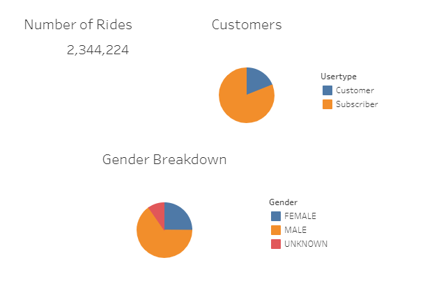
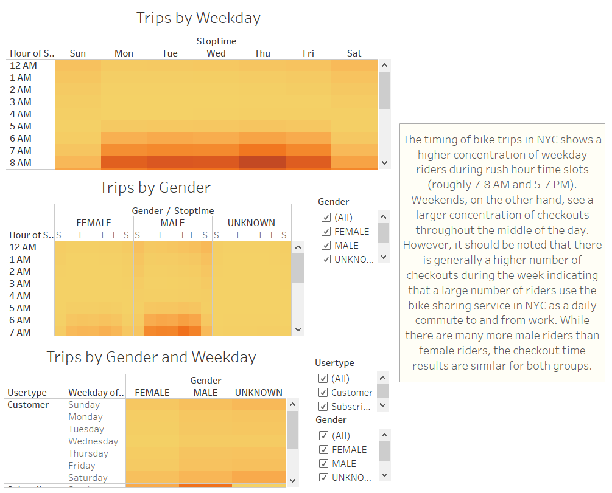
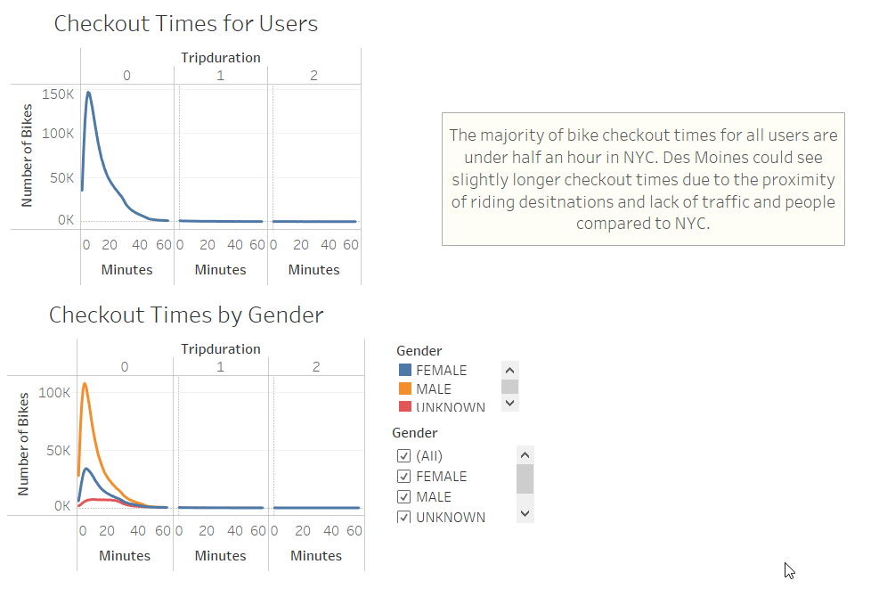
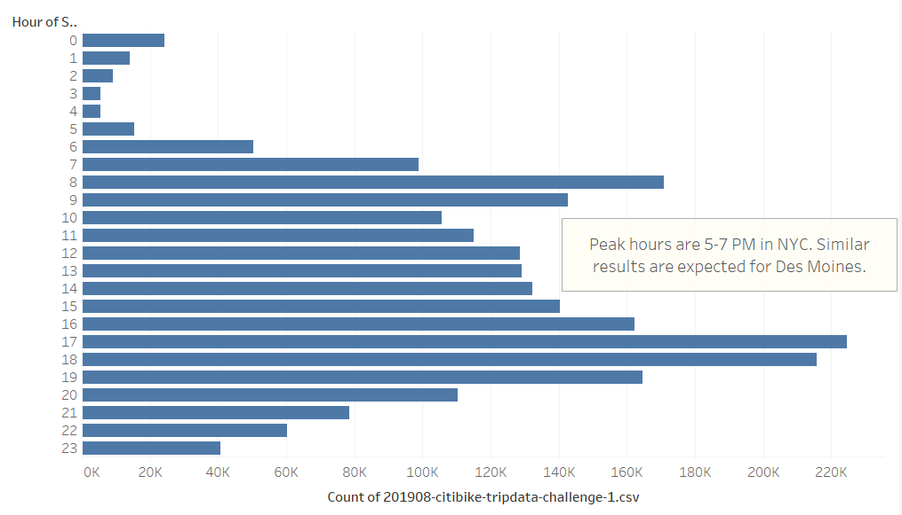
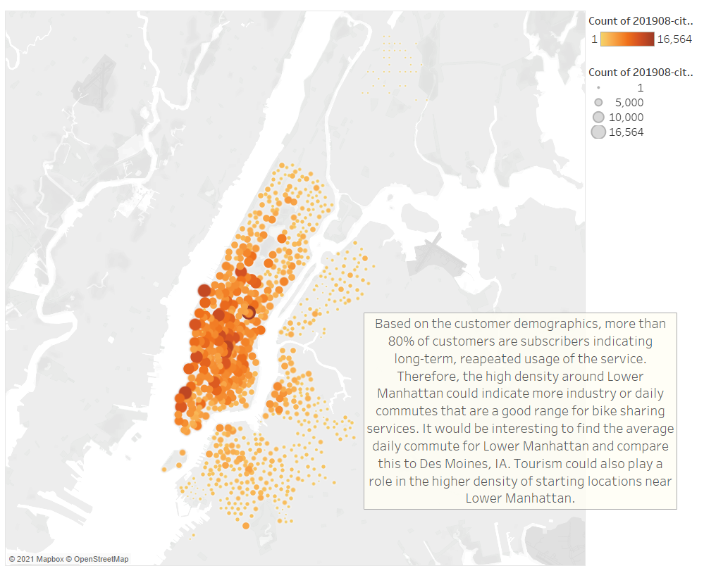
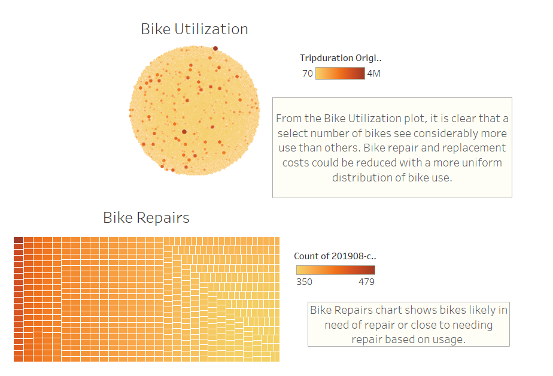

# Bike Sharing Analysis

## Bike Sharing Analysis Overview

This project used Tableau to analyze Citi Bike bike sharing services in NYC. The analysis was performed in support of a pitch for a startup company to offer a similar service in Des Moines, IA. Citi Bike data for August 2019 was downloaded from the Citi Bike website, manipulated in Jupyter Notebook, and analyzed in Tabluea. Insights from this analysis will help investors make an informed investment decision for bike sharing startup in Des Moines.

## Bike Sharing Analysis Results

The Tableau story for this project can be found at the link below: 

[Josh Shehan's Citi Bike Tableau Story](https://public.tableau.com/app/profile/josh.shehan/viz/CitiBike_Challenge_16218227246710/NYCBikeSharingStory)

To summarize, a breakdown of the customers is provided in Fig. 1. More than 2.3 million customers used NYC's bike sharing service in August 2019. Of those customers, more than 80% were subscribers, and roughly 65% were male. Therefore, the majority of customers appear to be long-term, everyday riders that likely use the service for their daily commute in August. Furthermore, most riders are male indicating that there could be a safety or a comfort issue with female riders using the bikesharing service. These trends would be expected to translate to Des Moines, and the percentage of subscribers could be higher due to a lack of tourism in Des Moines compared to NYC. This information is also valuable from a marketing perspective. If the customer population is largely working-class males, marketing efforts could be targeted at these individuals to launch the service in Des Moines.

*Figure 1. The total number of rides for August 2019 and a breakdown of customers by user type and gender*

Visualizations breaking down the trips by weekday and gender are shown in Fig. 2 as well as a visualization combining trips by weekday and gender. The data shows a higher concentration of riders during morning and evening rush hour times (roughly 7-8 AM and 5-7 PM) during the weekdays, and a higher concentration of riders through the middle of the day on weekends. The number of riders during the weekly rush hours is generally larger than the number of weekend riders further supporting the idea that a large number of riders use the NYC bike sharing service for daily work commutes. Although there are many more male riders than female riders, this trend is consistent among both genders. It is interesting to note that for cases where the gender of the rider is unknown, there seems to be a higher population of weekend riders. It is possible that weekend riders are typically not subscribers, and they do not provide gender information when they sign up for the service.

*Figure 2. A breakdown of trips by weekday, trips by gender, and trips by gender and weekday*

Figure 3 shows a breakdown of checkout times for NYC Citi Bike users. It is clear from the figure that across male, female, and unknown genders, the checkout time is generally under half an hour with relatively very few checkouts exceeding an hour. Furthermore, the peak trip duration is around 6 minutes for male and female riders. This also supports the idea that the bike service is practical for daily commutes. A five minute bike ride seems like a reasonable commute to and from work. This provides insight into further research that could support a bike sharing business in Des Moines. The average daily work commute distance could be compared to NYC to determine the viability of a bike sharing business. If the daily commute in Des Moines was much longer than in NYC, it could be difficult to support a successful bike sharing business. 

It is also interesting to note that the number of riders with unknown gender is fairly stable for checkout times ranging from roughly 7-25 minutes. This also supports the idea that the unknown riders are likely not subscribers. It is reasonable to think that one-time customers would be tourists or residents who check out bikes for longer-duration activities such as sight-seeing.

*Figure 3. A plot of checkout times for all users and a breakdown of checkout times by gender*

Figure 4 shows an hourly breakdown of the number of bike checkouts. The highest concentrations of bike checkouts occur during morning and evening rush hours supporting the arguments made previously that many riders use the service for work commutes.

*Figure 4. An hourly breakdown of bike rental start time for August 2019*

A map of starting locations is shown in Fig. 5 where the size and color of the circle indicate the popularity of each starting location. The figure shows a high density of starting locations in Lower Manhattan. This is a highly industrialized area, and it is not surprising that there is a high number of bike checkouts in this location. Lower Manhattan is also a very expensive area indicating that the population most likely to use a bike sharing service could include higher-income individuals. Lower Manhattan is also very dense in terms of population and points of interest for riders, which could also play a role in the large number of starting locations in this area. It would be interesting to also map stop locations to see the typical trip distances and compare this to rider points of interest in Des Moines.

*Figure 5. A map of starting locations for August 2019*

Visualizations showing bike wear and tear are shown in Fig. 6 to provide an idea of the possible maintenance schedule. It is clear from the visualization that a relatively small number of bikes are heavily utilized. This indicates that the system for bike use could be optimized in NYC, and that Citi Bike might own many more bikes than are necessary. This information could be used for the Des Moines startup to minimize maintenance costs as well as startup costs by purchasing fewer bikes relative to the population than in NYC and strategically deploying those bikes.

*Figure 6. Visualizations illustrating bike utilization and bikes likely in need of repair or close to needing repair for August 2019*

## Bike Sharing Analysis Summary

The analysis performed for this project revealed that more than 80% of the roughly 2.3 million NYC Citi Bike users for August 2019 were subscribers as opposed to one-time customers, and roughly 65% of the users were male. Additionally, the checkout times, trip durations, and start locations suggest that the most common use for the bike sharing service was morning and evening commutes. The most active checkout times corresponded to morning and evening rush hours, and the top locations were heavily concentrated around Lower Manhattan. Investigation of bike wear and tear also indicated that NYC Citi Bike operations have some inefficiencies in terms of bike distribution, and these findings can serve as lessons for the Des Moines startup.

To continue this analysis, demographic and geographic information for Des Moines should be compared to NYC. One insightful comparison would relate the total number of working-class males in Des Moines, IA to those in NYC to get an idea for the likely bike sharing usage in Des Moines. Furthermore, the following two additional visulizations would be valuable in determining the validity of a similar bike sharing service in Des Moines, IA.

1. It would be interesting to map the starting points, ending points, and trip duration in a single visualization to verify morning and evening commutes for NYC riders. The commute distance could be compared with average commutes in Des Moines to see if they are similar. If the commute in Des Moines is significantly longer than NYC, it could pose a challange for bike sharing users to use the service as a daily commute to and from work.

2. It woud be interesting to add a visualization to summarize the routes and distance for the most heavily utilized bikes. If heavily utilized bikes consistently follow the same route, a rotation program could be implemented where the bikes are transported to different areas to more evenly distribute bike utilization among the fleet. This could significantly reduce repair and replacement costs for bikes by allowing for a distance-based bike repair program. Furthermore, this information could enable a plan for reducing the number bikes required with more strategic bike deployment.